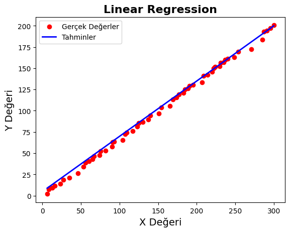

# Linear Regression Model

Bu proje, basit bir lineer regresyon modelinin oluşturulmasını ve uygulanmasını içerir. Kod, `pandas` ve `scikit-learn` kütüphanelerini kullanarak veri setini yükler, eğitim ve test veri setlerine ayırır, bir lineer regresyon modeli oluşturur ve tahminler yapar.

## Gereksinimler

- Python 3.x
- Pandas
- Scikit-learn
- Matplotlib (görselleştirmeler için)

Gereksinimlerinizi yüklemek için aşağıdaki komutları kullanabilirsiniz:

```bash
pip install pandas scikit-learn matplotlib
```

## Dosya Yapısı

- `linear_regression.csv`: Modelin eğitilmesi ve test edilmesi için kullanılan veri seti. Bu dosya, `X` ve `Y` adlı iki sütun içermelidir.
- `linear_regression.py`: Lineer regresyon modelini oluşturan ve uygulayan Python kodu.
- `regression_plot.png`: Opsiyonel. Gerçek değerlerle tahmin edilen değerlerin karşılaştırıldığı görsel.

## Kullanım

1. `linear_regression.csv` dosyasını, aynı klasöre yerleştirin.
2. Python kodunu çalıştırmak için aşağıdaki komutu kullanın:

    ```bash
    python linear_regression.py
    ```

3. Kod, `linear_regression.csv` dosyasındaki verilerle eğitim ve test işlemlerini gerçekleştirir ve tahmin sonuçlarını içeren bir veri çerçevesini ekrana yazdırır.

## Kod Açıklaması

- **Veriyi Yükle**: `linear_regression.csv` dosyası `pandas` ile yüklenir ve `X` (özellikler) ve `Y` (hedef değişkenler) ayrılır.
- **Eğitim ve Test Veri Setlerine Ayır**: Veri seti, eğitim ve test veri setlerine ayrılır. Eğitim veri seti modelin eğitilmesi için, test veri seti ise modelin performansının değerlendirilmesi için kullanılır.
- **Modeli Oluştur ve Eğit**: `LinearRegression` sınıfı kullanılarak bir model oluşturulur ve eğitim veri seti ile eğitilir.
- **Tahminler**: Eğitim ve test veri setleri için tahminler yapılır.
- **Sonuçların Veri Çerçevesine Eklenmesi**: Tahmin sonuçları orijinal veri çerçevesine eklenir ve sonuçlar ekrana yazdırılır.

## Görselleştirmeler

Gerçek değerlerle tahmin edilen değerlerin karşılaştırıldığı görsel `regression_plot.png` dosyasında bulunmaktadır. Bu grafik, modelin tahminlerinin gerçek verilerle ne kadar uyumlu olduğunu gösterir.



## Notlar

- Kodun çalışabilmesi için `linear_regression.csv` dosyasının doğru formatta ve uygun verileri içermesi gerekmektedir.
- Eğitim ve test veri setlerinin boyutları, `test_size=0.33` parametresi ile belirlenmiştir. Bu, veri setinin %33'ünün test verisi olarak kullanılacağı anlamına gelir.

## İletişim

Sorularınız veya geri bildirimleriniz için [uzayk204@gmail.com](mailto:uzayk204@gmail.com) adresine ulaşabilirsiniz.
